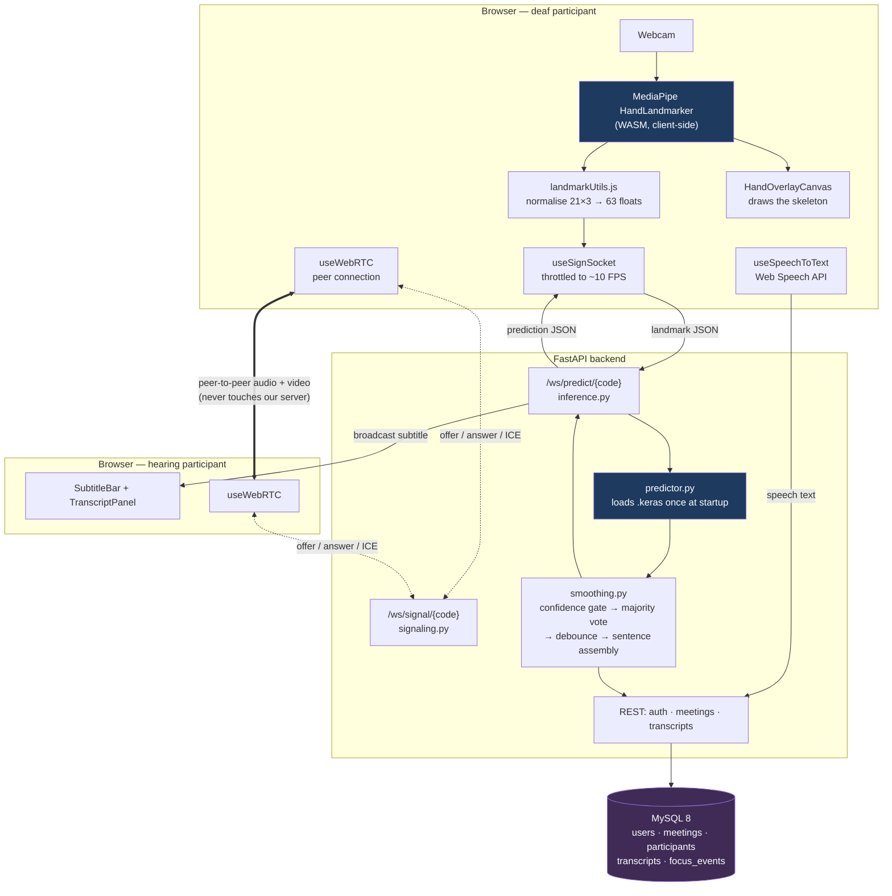
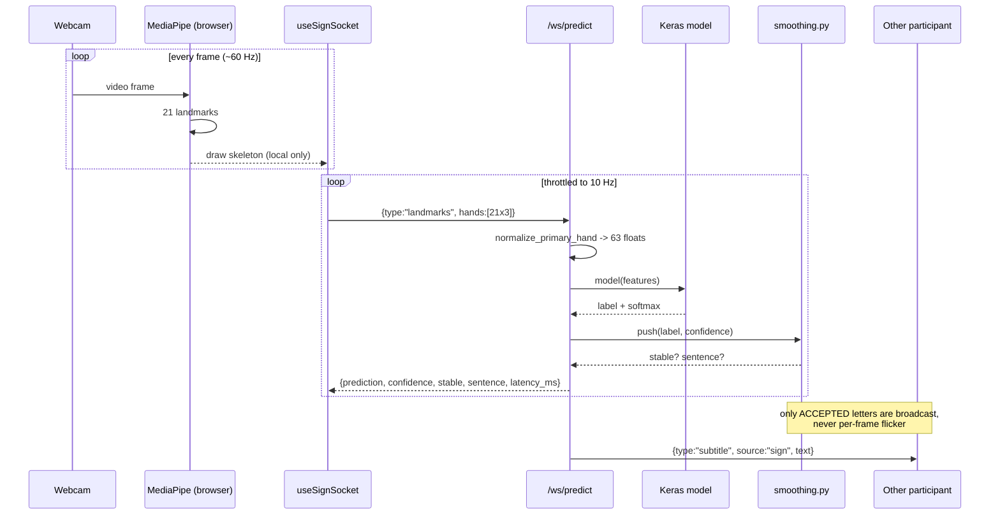
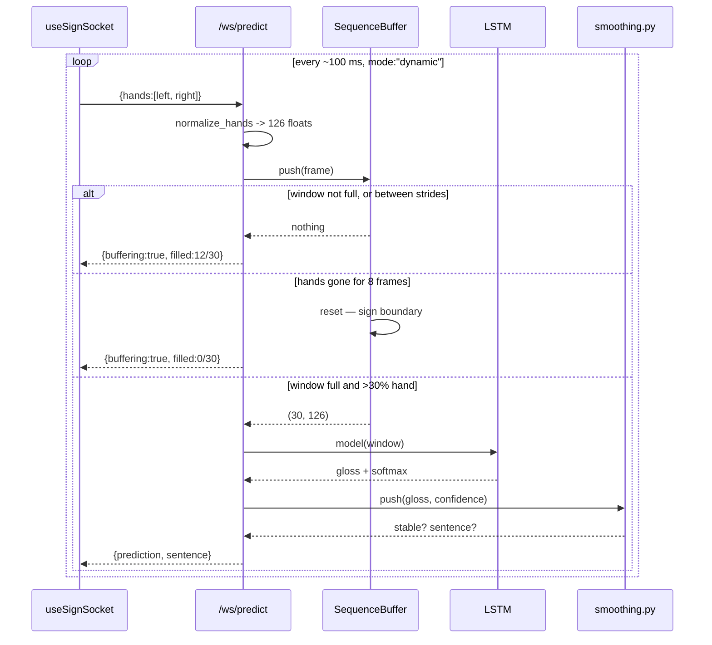
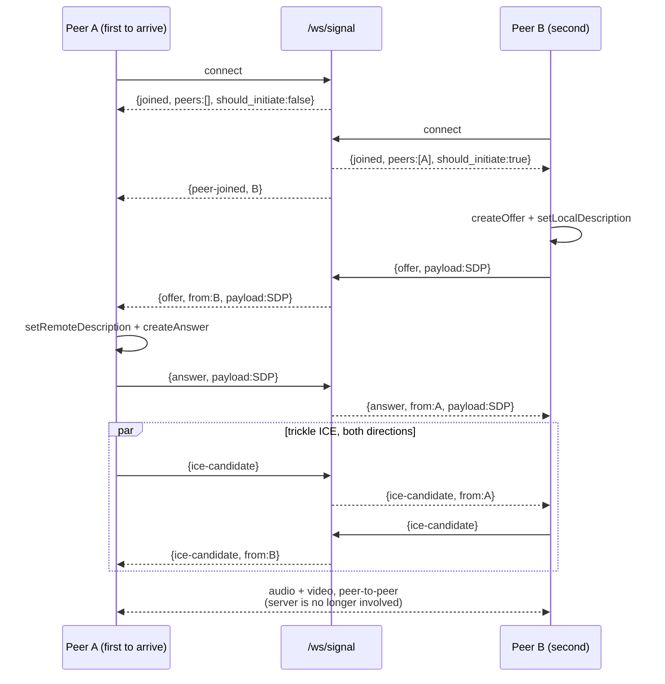

# BridgeTalk — Architecture

> The engineering view. The [README](README.md) is the teaching view, and
> covers the same system for a reader who has not seen the code.

---

## 1. The one decision that shapes everything

**Hand tracking runs in the browser. Only landmark coordinates cross the
network.**

MediaPipe's HandLandmarker turns a video frame into 21 (x, y, z) points per
hand. Those 63 floats are what BridgeTalk sends to the server — roughly 500
bytes per frame, or about 5 KB/s at our 10 FPS send rate.

The alternative — streaming video frames to the server and running MediaPipe
there — was rejected:

| | Landmarks in the browser (chosen) | Video to the server (rejected) |
|---|---|---|
| Bandwidth | ~5 KB/s | ~500 KB/s – 2 MB/s |
| Privacy | The user's video never leaves their machine | Every frame of a private conversation sits on our server |
| Server cost | One small `model.predict` per frame | Full MediaPipe pipeline per user per frame |
| Scaling | Tracking cost scales with clients, for free | Server becomes the bottleneck at a handful of users |
| Trade-off | Needs a browser that supports WASM + WebGL | Works on any client, including dumb ones |

The trade-off is real: an ancient browser without WASM support cannot run
BridgeTalk at all. For a conferencing tool used on laptops, that is an easy
trade to make, and it is a genuine selling point of the design rather than an
implementation detail.

---

## 2. Component view



Two things worth noticing in that diagram:

1. **Audio and video go peer-to-peer.** The backend is only a *signalling*
   server — it relays the offer, answer and ICE candidates that let two
   browsers find each other, then steps out of the media path entirely.
2. **The inference WebSocket and the signalling WebSocket are separate
   endpoints.** They have different lifetimes, different message contracts and
   different failure modes; multiplexing them onto one socket would mean a
   dropped call also kills sign recognition.

---

## 3. Request paths

### 3.1 Sign → text (the core loop)



The throttle is the design decision worth defending. Detection runs at full
frame rate because the overlay must look smooth and costs only local CPU.
Sending runs at 10 Hz because that is all the recognition needs: the majority
vote spans 10 frames, which at 10 Hz is a one-second decision — about how long
a person holds a letter. Sending at 60 Hz would sextuple traffic and server
load to reach the same conclusion a second later.

### 3.2 Word signs → text (Model B)

The same socket, the same landmarks, a different shape of question.



Three differences from the static path are worth stating, because each one is a
decision rather than an accident:

1. **Two hands, not one.** Word signs frequently use both, so features are 126
   wide with a slot per hand, fixed by handedness. The client tracks two hands
   in this mode or half of every input is zero.
2. **Most frames produce no prediction.** A window needs 30 frames — three
   seconds at 10 FPS — and only every third frame is then classified. Frames
   that predict nothing still report buffer progress, so the UI can show real
   filling instead of appearing broken.
3. **The training/inference mismatch is managed, not solved.** Model B is
   trained on segmented clips; live landmarks arrive as an unbroken stream. The
   buffer applies two heuristics — a run of hand-free frames is a boundary, and
   a mostly-empty window is never classified — and neither helps a signer who
   moves continuously without pausing. See `backend/app/ml/sequence.py`.

### 3.3 Speech → text

The hearing participant's browser runs the Web Speech API locally
(`useSpeechToText`). Interim results update their own caption immediately and
are relayed to the peer, but only **final** results are persisted — interim
text is revised word by word as the recogniser hears more, so storing it would
fill the transcript with fragments.

Speech travels over the **inference** socket, not the signalling one. That is
deliberate: this is the meeting's *text* channel, both directions belong
together, and a dropped video call must not take the captions down with it.

### 3.4 Call establishment (WebRTC signalling)



**Exactly one peer initiates.** Whoever arrives second is told
`should_initiate: true`, because they are the one who knows somebody is already
waiting. If both offered simultaneously the negotiations would collide ("glare")
and both would have to back off and retry.

**The server never parses SDP or ICE.** It stamps the sender and forwards the
payload verbatim. Not understanding the contents means a WebRTC specification
change needs no backend change at all.

---

## 4. Backend layering

```
app/main.py          FastAPI instance, CORS, router registration, model warm-up
├── api/             HTTP routers — thin; validate, delegate, serialise
├── ws/              WebSocket endpoints + connection manager
├── ml/              predictor · normalization · smoothing · sequence
│                    (pure functions where possible, so they are unit-testable
│                     without a running server)
├── models/          SQLAlchemy ORM — the only place that knows SQL exists
├── schemas/         Pydantic — the only place that defines the wire contract
├── core/            security (JWT, bcrypt), deps (get_current_user)
├── config.py        pydantic-settings, single source of truth for .env
└── database.py      engine + session factory
```

The rule that keeps this maintainable: **ORM models never leave the `api`
layer.** Routers convert them to Pydantic schemas before returning. That is what
stops a `password_hash` column accidentally appearing in a JSON response.

---

## 5. The normalisation contract

The constraint is stated here because it shapes several files at once. Full
explanation in [ml/README.md](ml/README.md#landmark-normalisation--the-critical-detail).

The same normalisation procedure is implemented **twice**, which is a deliberate
departure from the original specification's three (training, backend, browser).
Writing the same arithmetic twice in Python would manufacture exactly the drift
the requirement exists to prevent, so the training scripts import the backend's
implementation instead:

| Implementation | Runs | Purpose |
|---|---|---|
| `backend/app/ml/normalization.py` | Offline **and** per inference request | The single Python implementation. The ml/ training scripts import it rather than reimplementing it, so training and inference are identical by construction |
| `frontend/src/utils/landmarkUtils.js` | In the browser | The one boundary that can genuinely diverge, and what the parity test guards |

If these disagree by even a small amount, training accuracy stays at 97%
while live predictions become noise — the classic silent failure of this kind of
project. `backend/tests/` therefore contains a parity test that pushes the same
raw landmark array through the Python and JavaScript implementations and asserts
agreement to `1e-6`.

`metadata.json` records `"normalization_version": 1`, and the backend **refuses
to load a model** whose version does not match the code. A stale model file is
then a loud startup error instead of a mysterious accuracy collapse.

---

## 6. Data model

Full ER diagram in the [README](README.md#12-database-schema). The three
decisions that shape queries:

- **`meetings.ended_at IS NULL` is the definition of "active".** No separate
  boolean, so nothing can fall out of sync.
- **`meeting_participants` is a log, not a set.** Rejoining writes a new row, so
  a dropped connection stays visible instead of being silently overwritten.
- **Composite indexes match the actual access pattern**:
  `transcripts(meeting_id, created_at)` serves "this meeting's lines in order"
  in one lookup, and `meeting_participants(meeting_id, user_id)` serves "is this
  user in this meeting?".

All foreign keys cascade on delete, so removing a user cannot leave rows
pointing at an id that no longer exists.

---

## 7. Failure modes and how the system responds

| Failure | Detected by | Response |
|---|---|---|
| MySQL unreachable at startup | `lifespan` probe in `main.py` | Refuses to start, logs the fix. A server that starts and 500s every request is far harder to diagnose |
| No trained model | `predictor.load()` | **Starts anyway** — auth, meetings and transcripts still work. The socket reports `MODEL_NOT_LOADED` |
| No **dynamic** model | `dynamic_predictor.load()` | Logged at INFO, not WARNING — a deployment with only Model A is the expected configuration. The UI disables the word-sign toggle and shows why |
| Wrong model file in a slot | `predictor.load()` input-shape check | Refuses to load. Without it, loading the 63-input model into the dynamic slot would surface much later as a confusing TensorFlow shape error on the first frame |
| Dynamic window mostly empty | `SequenceBuffer` detection rate | No prediction attempted. The model would otherwise answer confidently about a window containing almost no hand |
| Model normalisation version mismatch | `predictor.load()` | **Refuses to load.** A mismatched model returns confident nonsense with nothing in the logs |
| Camera permission denied | `getUserMedia` error name | Named message per cause (`NotAllowedError`, `NotReadableError`, `NotFoundError`) with the actual fix |
| No hand in frame | Empty `hands` array | Neutral state emitted **without calling the model** — there are no landmarks to classify |
| Low confidence | Confidence gate | Frame discarded; the UI shows "settling" rather than a wrong letter |
| WebSocket dropped | `onclose` | Exponential backoff with jitter, up to 12 attempts. Code 1008 (bad token) stops immediately — retrying cannot fix it |
| Slow network | `bufferedAmount > 64 KB` | Frames dropped rather than queued. A backlog makes predictions arrive seconds late |
| WebRTC cannot connect | `connectionstatechange` → `failed` | Explains the NAT/TURN cause rather than spinning |
| Peer leaves | `peer-left` from the relay | Remote stream cleared, tile shows the waiting state |
| Render exception | `ErrorBoundary` | Explained error page with reload, instead of a white screen mid-call |
| Transcript write fails | `.catch()` on the API call | Swallowed deliberately — the words are already on screen, and that is what the conversation needs |
