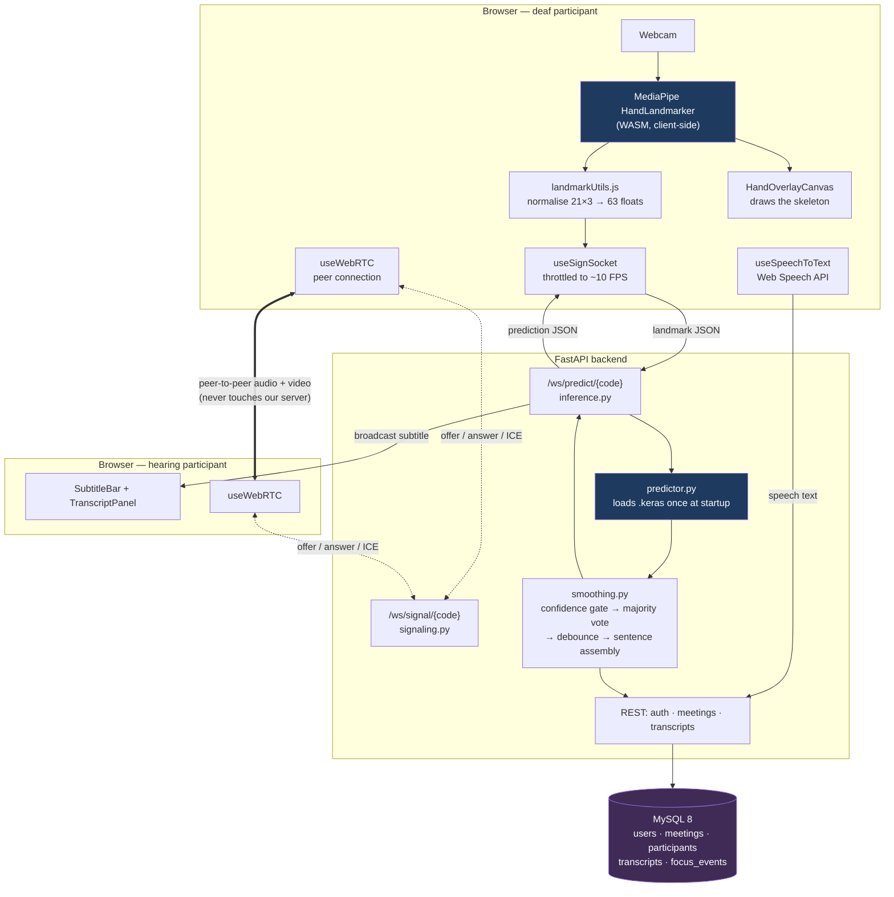

# BridgeTalk — Architecture

> **Phase 0 draft.** The component and sequence diagrams below describe the
> system as designed and as it will exist at the end of Phase 6. Sections
> tagged **_(Phase N)_** are completed when that phase lands. This file is the
> engineering view; the [README](README.md) is the teaching view.

---

## 1. The one decision that shapes everything

**Hand tracking runs in the browser. Only landmark coordinates cross the
network.**

MediaPipe's HandLandmarker turns a video frame into 21 (x, y, z) points per
hand. Those 63 floats are what BridgeTalk sends to the server — roughly 500
bytes per frame, or about 5 KB/s at our 10 FPS send rate.

The alternative — streaming video frames to the server and running MediaPipe
there — was rejected:

| | Landmarks in the browser (chosen) | Video to the server (rejected) |
|---|---|---|
| Bandwidth | ~5 KB/s | ~500 KB/s – 2 MB/s |
| Privacy | The user's video never leaves their machine | Every frame of a private conversation sits on our server |
| Server cost | One small `model.predict` per frame | Full MediaPipe pipeline per user per frame |
| Scaling | Tracking cost scales with clients, for free | Server becomes the bottleneck at a handful of users |
| Trade-off | Needs a browser that supports WASM + WebGL | Works on any client, including dumb ones |

The trade-off is real: an ancient browser without WASM support cannot run
BridgeTalk at all. For a conferencing tool used on laptops, that is an easy
trade to make, and it is a genuine selling point of the design rather than an
implementation detail.

---

## 2. Component view



Two things worth noticing in that diagram:

1. **Audio and video go peer-to-peer.** The backend is only a *signalling*
   server — it relays the offer, answer and ICE candidates that let two
   browsers find each other, then steps out of the media path entirely.
2. **The inference WebSocket and the signalling WebSocket are separate
   endpoints.** They have different lifetimes, different message contracts and
   different failure modes; multiplexing them onto one socket would mean a
   dropped call also kills sign recognition.

---

## 3. Request paths

### 3.1 Sign → text (the core loop)

_(Phase 5 — sequence diagram and per-file walkthrough.)_

### 3.2 Speech → text

_(Phase 6.)_

### 3.3 Call establishment (WebRTC signalling)

_(Phase 6.)_

---

## 4. Backend layering

```
app/main.py          FastAPI instance, CORS, router registration, model warm-up
├── api/             HTTP routers — thin; validate, delegate, serialise
├── ws/              WebSocket endpoints + connection manager
├── ml/              predictor · normalization · smoothing
│                    (pure functions where possible, so they are unit-testable
│                     without a running server)
├── models/          SQLAlchemy ORM — the only place that knows SQL exists
├── schemas/         Pydantic — the only place that defines the wire contract
├── core/            security (JWT, bcrypt), deps (get_current_user)
├── config.py        pydantic-settings, single source of truth for .env
└── database.py      engine + session factory
```

The rule that keeps this maintainable: **ORM models never leave the `api`
layer.** Routers convert them to Pydantic schemas before returning. That is what
stops a `password_hash` column accidentally appearing in a JSON response.

---

## 5. The normalisation contract

_(Full specification in Phase 3; the constraint is stated here because it
shapes three separate files.)_

The same normalisation procedure is implemented three times:

| Implementation | Runs | Purpose |
|---|---|---|
| `ml/scripts/preprocess.py` | Offline, once | Prepares the training set |
| `backend/app/ml/normalization.py` | Per inference request | Prepares live input |
| `frontend/src/utils/landmarkUtils.js` | In the browser | Client-side parity checks and overlay maths |

If these three disagree by even a small amount, training accuracy stays at 97%
while live predictions become noise — the classic silent failure of this kind of
project. `backend/tests/` therefore contains a parity test that pushes the same
raw landmark array through the Python and JavaScript implementations and asserts
agreement to `1e-6`.

`metadata.json` records `"normalization_version": 1`, and the backend **refuses
to load a model** whose version does not match the code. A stale model file is
then a loud startup error instead of a mysterious accuracy collapse.

---

## 6. Data model

_(Phase 1 — Mermaid ER diagram, indexes and cascade behaviour.)_

---

## 7. Failure modes and how the system responds

_(Phases 5–7. Planned coverage: camera permission denied, no hand in frame,
model file missing or version-mismatched, WebSocket dropped mid-meeting,
WebRTC negotiation failing behind a symmetric NAT, MySQL unreachable at
startup.)_
